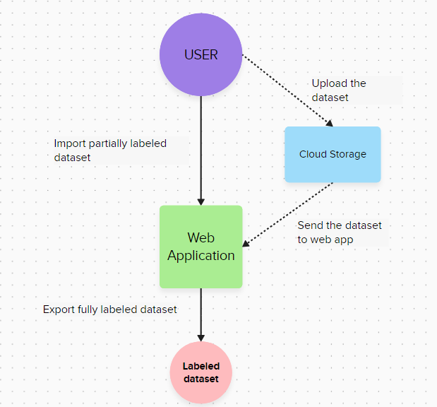
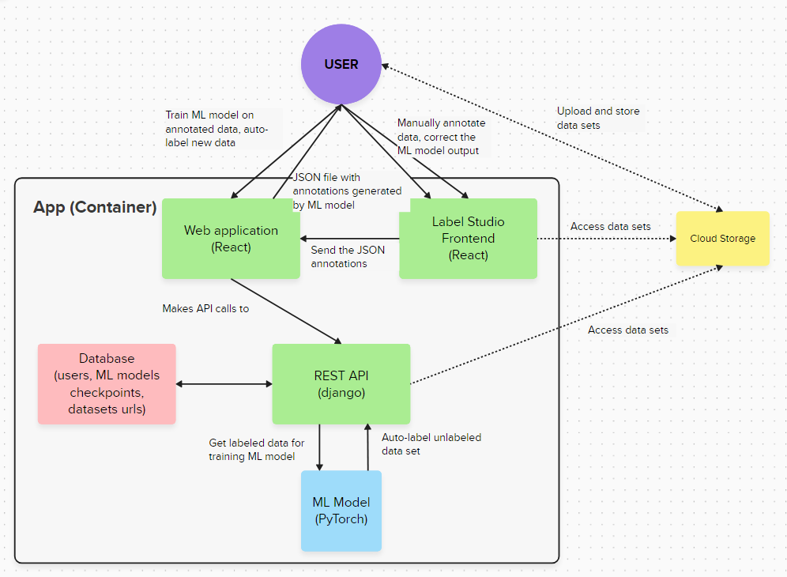
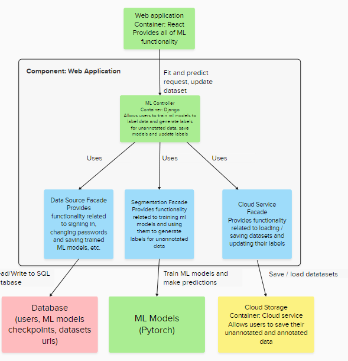
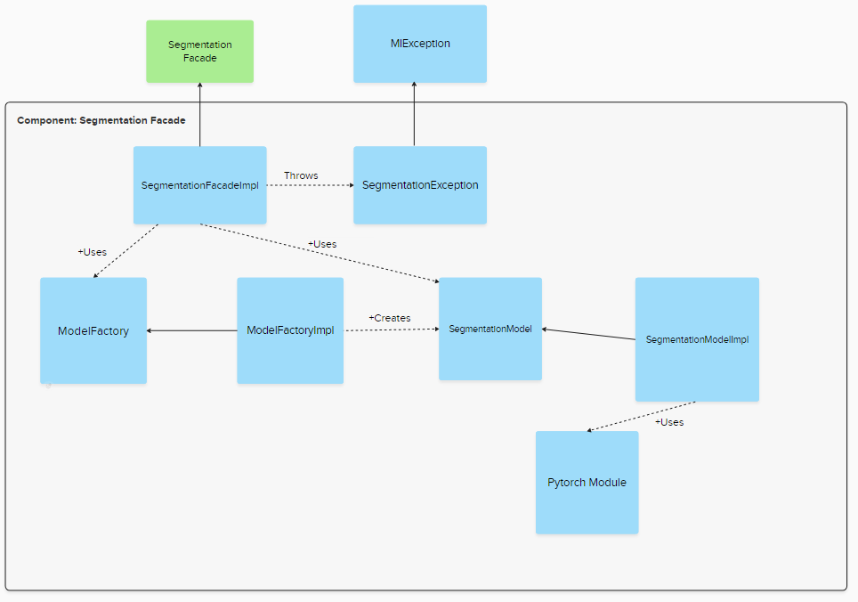

Architecture
============
Niniejszy opis przedstawia architekturę strony internetowej, która została zaprojektowana w celu automatycznego adnotowania danych za pomocą Sztucznej Inteligencji. 
Architektura ta skupia się na efektywnym zarządzaniu danymi, przechowywaniu ich, a także wykorzystuje możliwości uczenia maszynowego do automatycznego adnotowania danych.
Nasze rozwiązanie działa w formie mikro serwisu wspierającego narzędzie Label Studio.

1. Moduły:
a. Strona Internetowa E-Motion
b. Odpowiada za warstwę wizualną aplikacji dotyczącą modeli ML (moduł REST API)
c. Umożliwia trenowanie Modeli ML na adnotowanych danych oraz używania ich do generowania nowych adnotacji
d. Pozwala na przejście do Label Studio w celu poprawienia adnotacji wygenerowanych przez model ML

2. Label Studio Frontend:
a.      Odpowiada za warstwę wizualną aplikacji dotyczącą ręcznego adnotowania danych
b.      Zapewnia możliwość poprawienia adnotacji wygenerowanych przez model ML
c.       Ładowanie oraz zapisywanie informacji dotyczących adnotacji za pomocą plików JSON o odpowiedniej strukturze
3. REST API
a. Odpowiada za komunikację z serwisem chmurowym oraz Lokalną bazą danych w celu trenowania odpowiednich modeli ML
4. Baza danych
a. Przechowuje dane dotyczące kont użytkowników, zapisane modele ML oraz linki URL do projektów użytkownika przechowywanych w chmurze
5. Chmurowa baza danych
a. Przechowuje dane do adnotacji użytkowników
6. Modele ML
a. Odpowiadają za generowanie nowych adnotacji na podstawie ręcznie za adnotowanych danych

Perspektywa funkcjonalna użytkownika
1. Adnotacja danych na początku za pomocą Label Studio Front-end
2. Trening modelu ML na podstawie stworzonych adnotacji
3. Wygenerowanie reszty adnotacji za pomocą modelu ML
4. Poprawa wybranych adnotacji za pomocą Label Studio Front-end
5. Zapis adnotacji do bazy danych
 
Komunikacja z Label Studio Front-end
Label Studio jest narzędziem open-source służącym do ręcznego adnotowania danych. 
W jego skład wchodzi Label Studio Front-end, które umożliwia integrację tego narzędzia z naszym projektem. 
Label Studio wykorzystuje pliki JSON do przedstawiania stanu adnotacji danych. 
Taka struktura tego narzędzia powoduje, że w celu wymiany informacji między modelami ML (trening i generowanie adnotacji) a już gotowymi adnotacjami, będzie potrzeba serializacji i deserializacji plików JSON. 
W naszym rozwiązaniu adnotacje będą generowane w konwencji JSON używaną przez Label Studio, po czym użytkownik będzie mógł je ręcznie załadować do Label Studio Front-end w celu poprawienia błędów. 
Finalnie za adnotowane dane są zapisywane w tej samej konwencji JSON i mogą być użyte do wytrenowania kolejnego modelu, albo zapisane.
 
Autoryzacja:
Label Studio posiada wewnętrzny system autoryzacji mailowej, co powoduje, że użytkownik będzie musiał posiadać zarówno konto w naszym serwisie jak i w Label Studio, jeśli będzie chciał korzystać z funkcjonalności zapewnianych przez Label Studio Front-end

Baza danych:
Będziemy korzystać z bazy danych w celu autoryzacji użytkowników, przechowywaniu podstawowych informacji o ich projektach (odpowiedni link do bazy danych w chmurze) oraz zapisywanie wytrenowanych modeli Sztucznej Inteligencji.

Chmura:
Właściwe dane do adnotacji - zdjęcia będą przechowywane w chmurze w celu łatwej integracji z narzędziem Label Studio, które umożliwi szybkie nanoszenie poprawek na nieprawidłowo zaadnotowane zdjęcia.

Diagram C4:

Kontekst
----------

Kontener
----------

Component: WebApp
----------

Kod: Segmentaion Facade
----------

