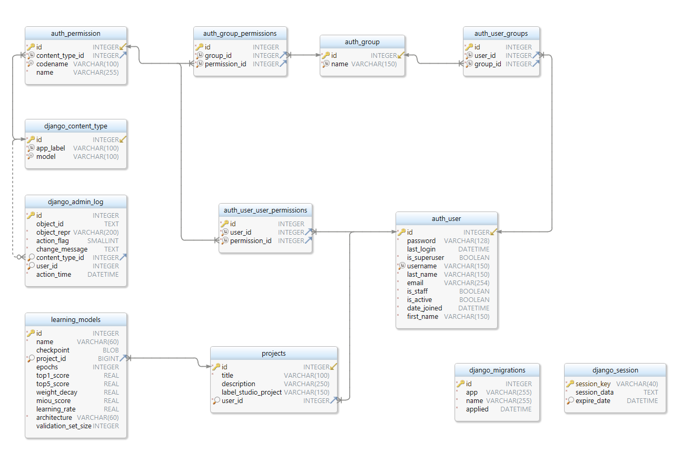

Data model
==========

ER diagram
----------

Persistent data representation
------------------------------
Relational database - SQLite

Logical model
-------------

    
Communication with database
---------------------------
Database is created and managed by Django framework.
Tables learning_models and projects are added in api/models.py file.
Other tables are built-in Django tables.
