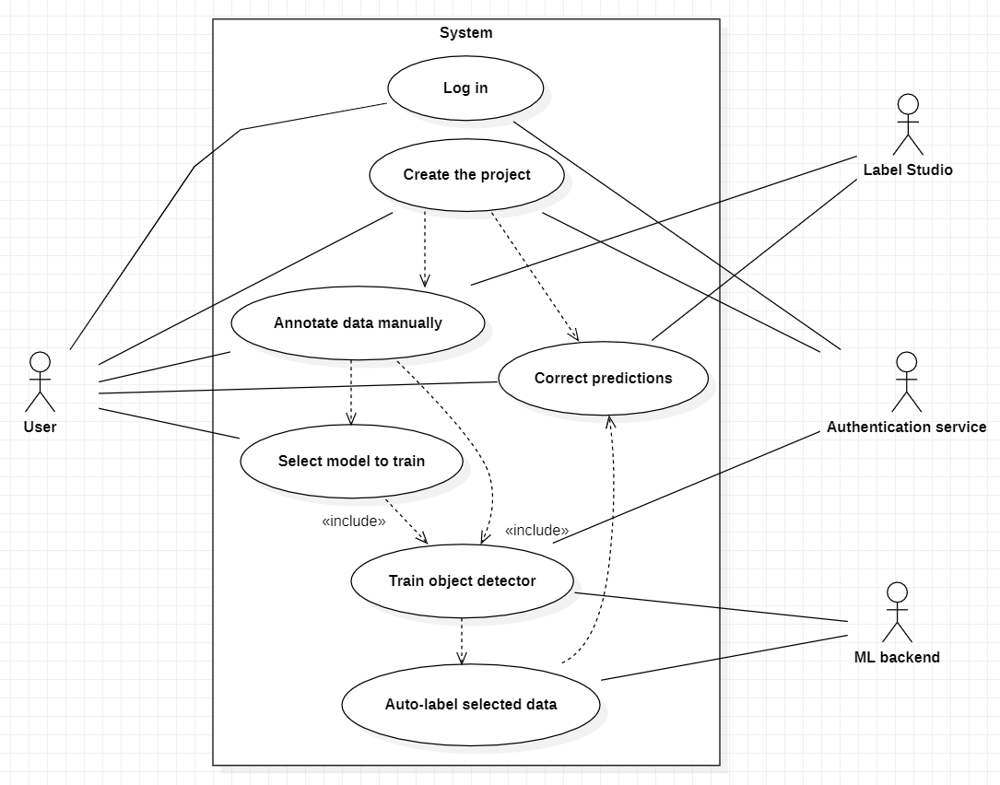
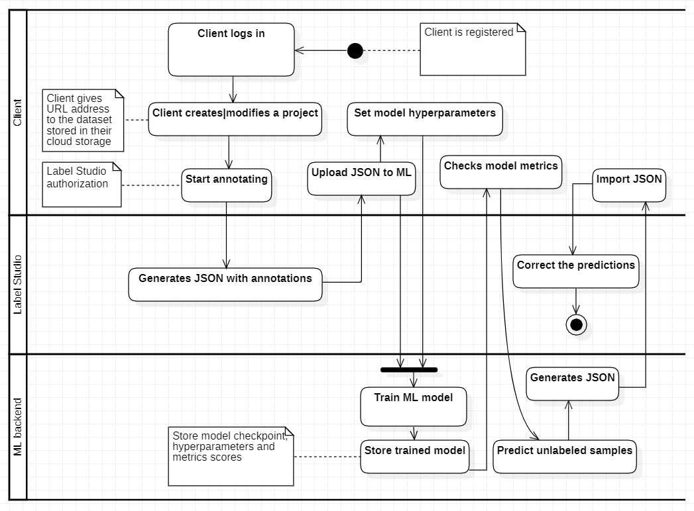
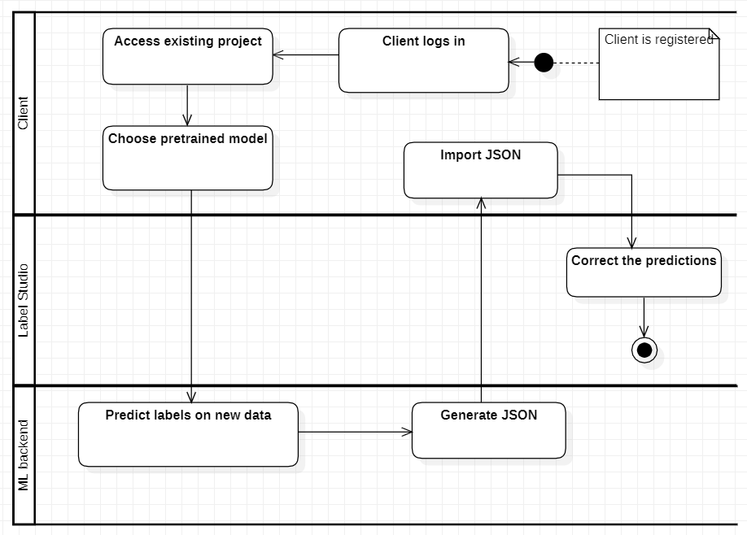

User Experience Design
=======================

Actors & User Stories
-----------------------

Employee of a Data Labeling Company
^^^^^^^^^^^^^^^^^^^^^^^^^^^^^^^^^^^^
| **User Story 1**
| As an employee of a data labeling company, I want to create and manage multiple annotation projects simultaneously, so that I can efficiently coordinate the labeling efforts of our team across different clients.

*Acceptance Criteria:*   
 - The user can create a new annotation project.
 - The user can easily switch between existing annotation projects.
 - Each project allows the definition of unique data categories and attributes.
|
| **User Story 2**
| As an employee of a data labeling company, I need the ability to easily switch between manual annotation and the ML model prediction correction mode, ensuring flexibility in our labeling workflows.

*Acceptance Criteria:*
 - The user can seamlessly switch between manual annotation and ML model prediction correction modes.
 - Changes made in one mode are reflected in the other to ensure consistency.
 - The transition between modes is intuitive and requires minimal effort.
|
| **User Story 3**
| As an employee of a data labeling company, I want to be able to download annotated data in a standardized format, allowing seamless integration with our clients' machine learning pipelines.

*Acceptance Criteria:*
 - The user can download annotated data in a standardized format (e.g., JSON).
 - The downloaded data includes all relevant annotations and metadata.
 - The downloaded data is compatible with common machine learning frameworks.

|

Academic Researcher Creating Specialized Dataset
^^^^^^^^^^^^^^^^^^^^^^^^^^^^^^^^^^^^^^^^^^^^^^^^
| **User Story 1**
| As an academic researcher, I want to define custom data categories and attributes specific to my research, ensuring that the dataset aligns with the objectives of my academic study.

*Acceptance Criteria:*   
 - The user can define custom data categories and attributes for their dataset.
 - The system validates the uniqueness and appropriateness of the defined categories.
 - Custom categories are accurately reflected in the annotation interface.
|
| **User Story 2**
| As an academic researcher, I need the ability to version my datasets, enabling me to track changes and improvements over time as my research progresses.

*Acceptance Criteria:*
 - The user can create multiple versions of a dataset.
 - Each version retains a snapshot of the dataset, including annotations and metadata.
 - The user can easily switch between different versions for analysis and comparison.

|
| **User Story 3**
| As an academic researcher, I want the option to share my labeled dataset with collaborators, making it easy to collaborate and receive feedback.

*Acceptance Criteria:*
 - The user can export the dataset along with annotations in a portable format.
 - The exported dataset retains all relevant metadata and annotations.
 - Collaborators can receive the exported dataset and integrate it into their own workflows for collaborative research.

|

ML Engineer Preparing Data for Modeling
^^^^^^^^^^^^^^^^^^^^^^^^^^^^^^^^^^^^^^^^
| **User Story 1**
| As an ML engineer, I want to choose from a variety of pre-trained model architectures, allowing me to quickly experiment with different approaches for my computer vision tasks.

*Acceptance Criteria:*   
 - The user can select from a variety of pre-trained model architectures.
 - Each model architecture provides relevant details, such as input requirements and supported tasks.
 - The selected model architecture can be seamlessly integrated into the annotation and training workflow.
|
| **User Story 2**
| As an ML engineer, I need a clear and intuitive interface to review and analyze the predictions made by the model, enabling me to identify areas for manual correction and improvement.

*Acceptance Criteria:*
 - The user can review model predictions for annotated data.
 - Predictions include bounding boxes or labels for identified objects.
 - The interface allows the user to easily navigate between annotated samples and associated predictions.

|
| **User Story 3**
| As an ML engineer, I want the option to save and download my trained models along with associated hyperparameters, streamlining the deployment process and ensuring reproducibility.

*Acceptance Criteria:*
 - The user can save trained models along with associated hyperparameters.
 - Downloaded models are compatible with common machine learning frameworks.
 - The saved models can be easily integrated into deployment pipelines for further use.

Use Cases
---------

**Use Case 1: Create Annotation Project**

| *Brief Description:* 
|   This use case involves the user creating a new annotation project, defining data categories, and efficiently managing multiple projects simultaneously for different clients.

| *Actors:*
|   Employee of a Data Labeling Company, Academic Researcher Creating Specialized Dataset, ML Engineer Preparing Data for Modeling

| *Preconditions:*
|   The user is logged into the ML-assisted labeling system.
*Basic Flow:*
 1. User accesses the dashboard.
 2. User clicks “Create new project” button
 3. The “Project Creation Pop-up” shows up
 4. User has to input: Project Name, Description, Dataset URL
 5. User clicks “Create Project”
 6. If all the data was inputted correctly project is  created and user receives notification that the “Project was created successfully”
 7. Page get’s refreshed, and the project overview pop-up shows up
*Alternate Flows:*  
  - In point 6: If the data was invalid the user gets taken back to the point 4 - he needs to fix invalid data 
*Exceptions:* 
 - In point 5: User decides not to create the project - he clicks the cancel button
 - In point 5: User decides not to create the project - he closes the whole page 
| *Success Conditions:*
|   A new annotation project is created and user can access it and work on it from now on.

| *Failure Conditions:*
|   A new annotation project is not created 

| *Views:*
|   Dashboard, Project Creation Pop-Up, Project Overview Pop-up
|

| **Use Case 2: Modify Annotation Project**
|
| *Brief Description:* 
|   This use case involves the user modifying the previously created project - including changing its properties.

| *Actors:*
|   Employee of a Data Labeling Company, Academic Researcher Creating Specialized Dataset, ML Engineer Preparing Data for Modeling

| *Preconditions:*
|   The user is logged into the ML-assisted labeling system, he has at least one created project.

*Basic Flow:*
 1. User accesses the dashboard.
 2. User clicks on existing project
 3. The “Project Overview Pop-up” shows up
 4. User can click on any of the properties: name, description, dataset URL and modify them
 5. After user made the changes, he clicks the “Modify” button
 6. If all the changes were possible project is modify and user receives notification that the “Project was modified successfully”
 7. User stays in the Pop-up window

*Alternate Flows:*  
  - In point 5: If the input was invalid changes are not saved, user gets notification and has to fix the issues, then he can return to point 5 

*Exceptions:* 
 - In point 4: User decides not to modify the project - he clicks the cancel button, or he closes the whole page

| *Success Conditions:*
|    Existing annotation project is modified, requested changes are saved in the database 

| *Failure Conditions:*
|   Existing annotation project is not modified

| *Views:*
|   Dashboard, Project Overview Pop-up
|

| **Use Case 3: Delete Annotation Project**
|
| *Brief Description:* 
|   This use case involves the user deleting an existing annotation project

| *Actors:*
|   Employee of a Data Labeling Company, Academic Researcher Creating Specialized Dataset, ML Engineer Preparing Data for Modeling

| *Preconditions:*
|   The user is logged into the ML-assisted labeling system, he has at least one created project.

*Basic Flow:*
 1. User accesses the dashboard.
 2. User clicks on existing project
 3. The “Project Overview Pop-up” shows up
 4. User clicks on the “Delete Project” button
 5. User needs to confirm it by typing “delete”
 6. If the confirmation was successful project is deleted, user receives notification that the “Project was deleted successfully”
 7. Page gets refreshed, and user is taken to the dashboard

*Alternate Flows:*  
  - If the confirmation was not successful in the first try, user can try until he succeeds

*Exceptions:* 
 - In point 5: User does not confirm the deletion process 

| *Success Conditions:*
|     Existing project is deleted 

| *Failure Conditions:*
|   The project is not deleted 

| *Views:*
|   Dashboard, Project Overview Pop-up
|

| **Use Case 4: Train ML Model**
|
| *Brief Description:* 
|   This use case involves the user training ML model of his choice with a given training dataset

| *Actors:*
|   Employee of a Data Labeling Company, Academic Researcher Creating Specialized Dataset, ML Engineer Preparing Data for Modeling

| *Preconditions:*
|   The user is logged into the ML-assisted labeling system, he has an already created project, he has manually annotated training set

*Basic Flow:*
 1. User accesses the ML models list.
 2. User chooses the ML model
 3. The “ML Model Overview Pop-up” shows up
 4. User loads a .JSON file with training set annotations 
 5. User clicks the “Train Model” button
 6. If all the data input was correct the training process will start, once it’s finished user gets a proper notification
 7. The “Training results Pop-up” is shown, where user can save the model, and check its quality measures

*Alternate Flows:*  
  - Before point 5: User can adjust the model hyperparameters (check use case 5)
  - In point 6: Input was incorrect - user has to fix the issues first - then he can continue the training

*Exceptions:* 
  - In point 6: User decides not to train the model - closes the pop-up
  - In point 6: User can’t provide valid input - the training can’t be started
  - In point 7: Quality measures weren’t satisfying - user doesn’t save the model

| *Success Conditions:*
|   ML Model is trained and saved by the user 

| *Failure Conditions:*
|   ML Model’s training was not done 

| *Views:*
|   ML Models List, ML Model Overview Pop-up, Training results Pop-up
|

| **Use Case 5: Adjust ML Model**
|
| *Brief Description:* 
|   This use case involves the user adjusting hyperparameters of the ML Model

| *Actors:*
|   Employee of a Data Labeling Company, Academic Researcher Creating Specialized Dataset, ML Engineer Preparing Data for Modeling

| *Preconditions:*
|   The user is logged into the ML-assisted labeling system, he has an already created project, user have chosen the ML model and opened its Overview Pop-up

*Basic Flow:*
 1. User clicks the “Adjust Hiperparameters” button
 2. The field for hyperparameters configuration shows up
 3. User inputs hyperparameters configuration code 
 4. User clicks “Save Configuration” button
 5. If all the data was inputted correctly, configuration is saved and user receives notification: “Configuration saved”
 6. User can start training now

*Alternate Flows:*  
  - In point 5: If the data was invalid the user has to fix the configuration before saving it

*Exceptions:* 
 - In point 4: User decides to stop - closes the pop-up
 - In point 4: User couldn’t input valid configuration

| *Success Conditions:*
|   New ML Model configuration is saved 

| *Failure Conditions:*
|   ML Model configuration stays the same as it was before

| *Views:*
|   ML Models List, ML Model Overview Pop-up
|

| **Use Case 6: Manually annotate dataset**
|
| *Brief Description:* 
|   This use case involves the user manually annotating part of the dataset

| *Actors:*
|   Employee of a Data Labeling Company, Academic Researcher Creating Specialized Dataset, ML Engineer Preparing Data for Modeling

| *Preconditions:*
|   The user is logged into the ML-assisted labeling system, user has already created project

*Basic Flow:*
 1. User accesses the Label Studio Frontend module
 2. User manually annotates the dataset in LSF
 3. User downloads the .JSON file generated by LSF

*Alternate Flows:*  
  - User could potentially use any other offshore annotating tool that would generate right .JSON file 

*Exceptions:* 
 - The exceptions handling is covered by LSF, we only provide it as an integrated module  

| *Success Conditions:*
|   User successfully creates .JSON with annotations

| *Failure Conditions:*
|   User couldn’t create the .JSON file 

| *Views:*
|   Label Studio Frontend
|

| **Use Case 7:  Predict labels for the dataset**
|
| *Brief Description:* 
|   This use case involves the user generating the predicted annotations for the dataset, with the usage of the ML Model

| *Actors:*
|   Employee of a Data Labeling Company, Academic Researcher Creating Specialized Dataset, ML Engineer Preparing Data for Modeling

| *Preconditions:*
|   The user is logged into the ML-assisted labeling system, user has created annotation project, user has trained the ML model

*Basic Flow:*
 1. User accesses the ML Models List 
 2. User chooses the ML Model
 3. User clicks “Predict Labels” button
 4. If the action was viable the ML model starts predictions and user receives a notification “Predictions has started”
 5. When the predictions are completed user receives a notification and the .JSON file gets generated 
 6. User can download the predictions by clicking “Download” button

*Alternate Flows:*  
 - There isn’t any, user has to follow basic flow

*Exceptions:* 
 - ML Model couldn’t generate the predictions due to an error 

| *Success Conditions:*
|     Predictions were generated into a .JSON file, user downloaded it 

| *Failure Conditions:*
|   The predictions weren’t generated, or user couldn’t download the file 

| *Views:*
|   ML Models List
|

| **Use Case 8: Adjust annotations dataset**
|
| *Brief Description:* 
|   This use case involves the user manually adjusting the annotations generated by the ML model annotation project

| *Actors:*
|   Employee of a Data Labeling Company, Academic Researcher Creating Specialized Dataset, ML Engineer Preparing Data for Modeling

| *Preconditions:*
|   The user is logged into the ML-assisted labeling system, user has created annotation project, user generated the predictions of the label and has the .JSON file

*Basic Flow:*
 1. User accesses the Label Studio Frontend
 2. User uploads the .JSON file
 3. User manually adjusts the labels 
 4. User downloads the corrected dataset labels as a .JSON file

*Alternate Flows:*  
  - User could potentially use any other offshore annotating tool that would generate right .JSON file 

*Exceptions:* 
 - The exceptions handling is covered by LSF, we only provide it as an integrated module 

| *Success Conditions:*
|     User downloads the .JSON file with corrected labels

| *Failure Conditions:*
|   User doesn’t the file with corrected labels 

| *Views:*
|   Label Studio Frontend
|

**Objects coverage by the use cases**

+-------------------+------------+-----------------+-----------------+------------------+----------------+-------------------+------------------+------------------+----------------+---------------------+
| Object / Use Case | log in     | create project  | modify project  | delete project   | save project   | annotate manually | conf. ML model   | train ML model   | predict labels | correct annotations |
|                   |            |                 |                 |                  |                |                   |                  |                  |                |                     |
+-------------------+------------+-----------------+-----------------+------------------+----------------+-------------------+------------------+------------------+----------------+---------------------+
|   backend         |    x       |     x           |        x        |      x           |                |                   |       x          |                  |                |                     |
+-------------------+------------+-----------------+-----------------+------------------+----------------+-------------------+------------------+------------------+----------------+---------------------+
|  Label Studio     |    x       |                 |                 |                  |                |        x          |                  |                  |                |         x           |
+-------------------+------------+-----------------+-----------------+------------------+----------------+-------------------+------------------+------------------+----------------+---------------------+
|   ML module       |            |                 |                 |                  |                |                   |                  |        x         |        x       |                     |
+-------------------+------------+-----------------+-----------------+------------------+----------------+-------------------+------------------+------------------+----------------+---------------------+
|     Database      |            |                 |                 |                  |        x       |                   |                  |                  |                |                     |
+-------------------+------------+-----------------+-----------------+------------------+----------------+-------------------+------------------+------------------+----------------+---------------------+

|

**Use case diagram:**

Activity Diagrams
-----------------

Activity diagram for usage of new ML model:

Activity diagram for usage of existing pretrained ML model for new data in dataset (existing projects):

